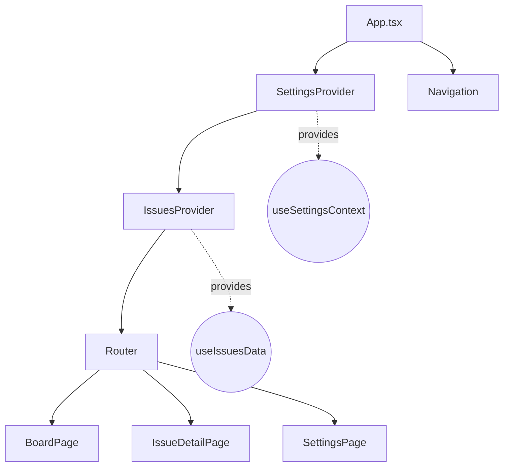
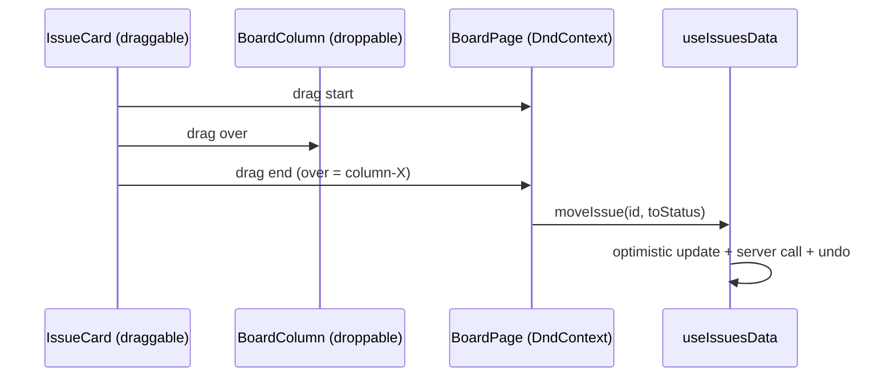

# Architecture Overview

This document explains the structure, responsibilities, and data flows of the Kanban Issue Board. It covers state management, business logic hooks, UI composition, drag & drop, optimistic updates with undo, polling/merging, permissions, and persistence.

## Goals
- Business logic in hooks; UI components are presentational.
- Single-responsibility modules with clear, typed contracts.
- Deterministic sorting, resilient optimistic updates, and undo semantics.
- Minimal dependencies, simple architecture, and good UX defaults.

## High-Level Structure



- SettingsProvider: Stores global app settings (e.g., polling interval) in localStorage.
- IssuesProvider: Owns issues state, optimistic updates, undo, polling and reconciliation.
- Router: Routes to pages; navigation bar is always visible.

## Responsibilities by Module

### Types and Utilities
- `src/types.ts`
  - `Issue`, `IssueStatus`, `IssuePriority`, `RecentlyAccessedItem`, `IssuesState`.
- `src/utils/scoring.ts`
  - `computePriorityScore(issue, now)` implements README formula.
  - `compareIssuesByPriority(a, b)` provides deterministic ordering.
- `src/services/issuesService.ts`
  - Thin adapter over `mockFetchIssues` and `mockUpdateIssue` (infra boundary).

### Hooks (Business Logic)
- `src/hooks/useSettings.tsx`
  - Persists `pollingIntervalMs` to localStorage.
  - Exposes `SettingsProvider`, `useSettingsContext()` for global consumption (and `useSettings()` fallback).
- `src/hooks/usePolling.ts`
  - Generic polling with inflight guard and cleanup.
- `src/hooks/usePermissions.ts`
  - Computes permissions from `currentUser` (admin vs contributor).
- `src/hooks/useRecentlyAccessed.ts`
  - Stores last 5 visited issues in localStorage with timestamps.
- `src/hooks/useSearchFilter.ts`
  - Holds filter state; gives a pure predicate for filtering by query/assignee/severity.
- `src/hooks/useBoardSorting.ts`
  - Groups issues by status and sorts within groups with `compareIssuesByPriority`.
- `src/hooks/useIssuesData.tsx`
  - Source of truth for issues with:
    - Fetch/load state and `issueMap` selector.
    - Optimistic updates with a 5s undo window.
    - Undo manager with per-issue previous snapshot.
    - Polling via `usePolling` and merging via `serverShadowRef`.
    - Permission enforcement at the domain layer.
    - Public API: `issues`, `issueMap`, `loading`, `error`, `lastSyncAt`, `pendingIssueIds`, `refetch`, `moveIssue`, `updateIssue`, `markResolved`, `setUserRank`, `undoLast`.

### Pages (Composition)
- `src/pages/BoardPage.tsx`: Orchestrates filters, sorting, drag & drop, and renders columns. Shows last sync time; Recently Accessed sidebar.
- `src/pages/IssueDetailPage.tsx`: Shows details and “Mark as Resolved”; records recent on mount.
- `src/pages/SettingsPage.tsx`: Selects polling interval; backed by `useSettings`.

### Components (Presentational)
- `src/components/Navigation.tsx`: Sticky top nav; shows last sync indicator and links.
- `src/components/LastSyncIndicator.tsx`: Displays last sync time.
- `src/components/SearchFilterBar.tsx`: Inputs for search, assignee, severity.
- `src/components/BoardColumn.tsx`: A status lane; droppable target.
- `src/components/IssueCard.tsx`: Draggable card; shows issue basics and rank editor (with drag handle).
- `src/components/RecentlyAccessedSidebar.tsx`: Lists last 5 visited issues with titles.

## Data Flow: Optimistic Update + Undo

```mermaid
sequenceDiagram
  participant UI as UI (IssueCard/Board)
  participant Hook as useIssuesData
  participant API as issuesService
  participant Shadow as serverShadowRef

  UI->>Hook: updateIssue(id, changes)
  activate Hook
  Hook->>Hook: beginOptimistic + applyLocalUpdate
  Hook->>UI: show Undo toast (5s)
  Hook->>API: updateIssueOnServer(id, changes)
  API-->>Hook: success
  Hook->>Shadow: update shadow with current issue
  deactivate Hook
  Note over Hook: If Undo clicked within 5s → rollback

  UI->>Hook: undoLast(id)
  Hook->>Hook: revert local state to previous; endOptimistic
  Hook->>API: best-effort revert on server
  Hook->>Shadow: set shadow to previous
```

Key points:
- Local state changes immediately for snappy UX.
- Undo window is 5 seconds; server errors trigger immediate rollback.
- `serverShadowRef` ensures polling does not revert confirmed updates.

## Polling and Reconciliation

```mermaid
flowchart LR
  F[fetchIssues()] --> M{pendingIssueIds > 0?}
  M -- yes --> S1[Skip poll to avoid clobber]
  M -- no --> Merge[Merge fetched with serverShadowRef]
  Merge --> State[set issues, lastSyncAt]
```

- Polling is controlled by `SettingsProvider` (default 10s).
- If any optimistic update is pending, polling is temporarily skipped.
- When polling proceeds, fetched data is merged with `serverShadowRef` to preserve confirmed changes.

## Sorting, Search, Filter
- Sorting by priority uses the README formula: `score = severity * 10 + (daysSinceCreated * -1) + userDefinedRank`.
- Higher scores first; tie-break: newer `createdAt`, then `id`.
- `useSearchFilter` filters by case-insensitive title/tags, assignee, and severity.
- `useBoardSorting` groups by status and sorts within each column.

## Permissions
- `usePermissions` computes capabilities from `currentUser`.
- All mutating actions (`moveIssue`, `updateIssue`, `markResolved`, `setUserRank`) check permissions in `useIssuesData` and no-op with a deduped toast if disallowed.

## Drag & Drop



- Cards are draggable; columns are droppable targets.
- On drop, `BoardPage` calls `moveIssue` with the target status.
- Title link is click-safe (does not initiate drag); there is a dedicated drag handle.

## Recently Accessed
- `useRecentlyAccessed` keeps a rolling list (max 5) of issue IDs visited.
- Stored in localStorage; sidebar displays `#id – title` by mapping with `issueMap`.

## Styling Philosophy
- Modern, high-contrast dark UI with subtle glassmorphism:
  - Sticky, translucent nav with blur.
  - Elevated cards, soft shadows, rounded corners.
  - Muted, accessible colors; readable typography.
- All styles live in `src/index.css` under `kb-*` class names.

## Extensibility Notes
- Swap mock API for real API by replacing `issuesService` (preserve contracts).
- Add persistence for shadow state by syncing `serverShadowRef` to localStorage.
- Upgrade or configure DnD to add distance-based activation if desired.
- Unit test candidates: scoring comparator, optimistic/undo manager.

## File Map
- App & Routing: `src/App.tsx`, `src/index.tsx`, `src/components/Navigation.tsx`
- Domain Hooks: `src/hooks/useIssuesData.tsx`, `useBoardSorting.ts`, `useSearchFilter.ts`, `usePermissions.ts`, `usePolling.ts`, `useSettings.tsx`, `useRecentlyAccessed.ts`
- UI Components: `src/components/*`
- Pages: `src/pages/*`
- Utilities/Services: `src/utils/scoring.ts`, `src/services/issuesService.ts`, `src/utils/api.ts`
- Types: `src/types.ts`

## Known Constraints
- Mock API does not persist changes; `serverShadowRef` simulates persistence for polling.
- Drag activation constraints are limited by installed `@dnd-kit/core` version; dedicated handle mitigates accidental drags.
